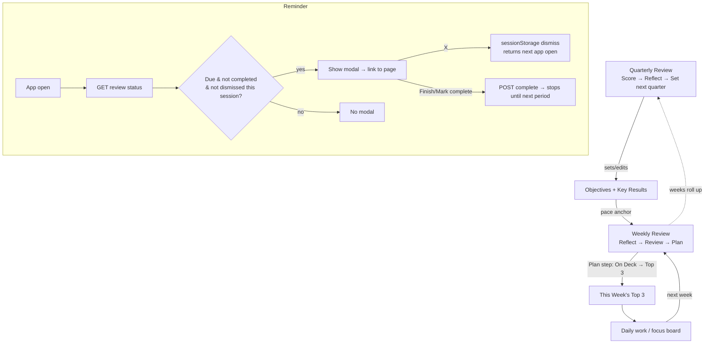

# Recurring Weekly + Quarterly Review System - Plan

## Goal Capsule

**Objective:** Turn the buried, passive Weekly Review into a recurring, prompted, well-designed ritual, and add a matching Quarterly Review — both surfaced by a persistent pop-up when due, wired into the quarterly OKRs and the On Deck → This Week's Top 3 flow.

**Product authority:** In-session brainstorm (this conversation). No separate requirements doc was written; the resolved product decisions are captured below as Requirements and Key Technical Decisions.

**Open blockers:** None. A handful of non-blocking design defaults are recorded in Open Questions.

---

## Summary

Today the Weekly Review (`src/pages/weekly-review.tsx`) is a flat, per-week form the user has to remember to visit; there is no Quarterly Review, no reminder, and no connection to the objectives or the On Deck shortlist. This plan adds:

1. A **persistent modal pop-up** on app open when a weekly/quarterly review is due or overdue — dismissible for the current session but reappearing every app open until the review is marked complete.
2. A **redesigned Weekly Review** — same reflection content, restructured into Reflect → Review → Plan, ending by picking **This Week's Top 3 from On Deck**, anchored to live OKR pace.
3. A **new Quarterly Review** — Score → Reflect → Set next quarter — that auto-pulls objectives and their key-result progress to score, and edits objectives going forward.
4. **Hybrid presentation** — a nice single page by default, with an optional guided step mode.
5. **Completion + status tracking** so cadence (and a streak) is visible and the pop-up knows when to stop.

---

## Problem Frame

- The review page is *hidden and passive* — nothing pulls the user into it, so the ritual lapses.
- It is *disconnected* — the week's plan doesn't draw from On Deck, and neither weekly nor quarterly connects to the objectives that pace pills already track.
- There is *no quarterly ritual* — objectives run on a calendar-quarter cadence (pace pills) but nothing scores a quarter or sets the next one.
- The UI is a long column of textareas — functional but not something the user wants to open.

---

## Requirements

- **R1** — When the app loads and a weekly or quarterly review is due/overdue and not completed, show a modal reminder linking to that review page.
- **R2** — The reminder can be dismissed (X) for the current app session but reappears on every subsequent app open until the review is marked complete.
- **R3** — The weekly review becomes "due" on a configurable day of week (default Sunday) and stays due into the new week until completed.
- **R4** — The quarterly review becomes due at the start of each calendar quarter and stays due until completed.
- **R5** — Marking a review **complete** (explicit "Finish / Mark complete") is the only thing that stops the reminder for that period, and records completion.
- **R6** — The weekly review is presented as a hybrid: a single well-designed page by default, plus an optional guided step-by-step mode.
- **R7** — The weekly review preserves all existing reflection + planning fields.
- **R8** — The weekly review's "Plan" step lets the user pick **This Week's Top 3 from On Deck**, and surfaces the current quarter's objectives with pace as an anchor.
- **R9** — A new quarterly review page presents Score → Reflect → Set next quarter, hybrid like the weekly.
- **R10** — The quarterly review's "Score" step auto-pulls the user's objectives and their key-result progress; scores are snapshotted into the review's saved content.
- **R11** — The quarterly review's "Set next quarter" step lets the user edit/add objectives going forward (carry-forward = keep an objective).
- **R12** — Both reviews and a cadence/streak indicator are surfaced prominently in navigation (no longer buried).

---

## Key Technical Decisions

- **KTD1 — Due-ness computed client-side, completion from the server.** The frontend already knows the date and the configured due-day, so it computes "is a review due"; the backend supplies "is this period completed." The reminder modal mounts once in `src/components/layout.tsx` (wraps every route) and reads a status query on load. Session dismissal uses `sessionStorage` so it clears on a fresh app open. *(Rationale: no email/push infra needed; single-user app; smallest surface that satisfies R1–R2.)*
- **KTD2 — Completion tracked in a new `review_completions` table**, mirroring the existing `idealWeekCompletionsTable` pattern: `(kind, year, period, completed_at)` where `kind ∈ {weekly, quarterly}` and `period` is ISO week or quarter number. Unique on `(kind, year, period)`.
- **KTD3 — Configurable weekly due-day lives in `localStorage` (default Sunday) for v1.** No settings table exists; a single-user app doesn't need cross-device sync yet. Promoting to a server setting is deferred.
- **KTD4 — Quarterly persistence mirrors weekly.** New `quarterly_review_entries` table `(year, quarter, field_key, content)` and a `quarterlyReview.ts` router that mirrors `weeklyReview.ts` (per-field GET/PUT, debounced autosave). *(Rationale: identical shape → reuse the proven pattern.)*
- **KTD5 — Objectives are NOT quarter-stamped, and this plan does not add stamping.** `cc_objectives` has no quarter column; pace is derived vs. the current calendar quarter. The quarterly review therefore **scores the current objectives** at review time and snapshots each score into its own saved fields; "Set next quarter" edits objectives forward via the existing objectives/key-results endpoints. Per-quarter objective historization is explicitly deferred (see Scope Boundaries).
- **KTD6 — Hybrid = one page + a local "guided mode" toggle, not separate routes.** Guided mode is UI state over the same sections and same persistence; the reminder's "Start review" can deep-link into guided mode via a query param.
- **KTD7 — Reuse, don't reinvent.** The On Deck → Top 3 picker reuses the existing `FocusSnapshot` pin/slot logic (`src/pages/ideal-week.tsx`); OKR pace reuses `paceOf` / objectives (`src/pages/command-center.tsx`); the modal reuses the Radix `Dialog`; weekly persistence stays as-is. Schema changes ship via drizzle `push` (no migration files).

**Product Contract preservation:** N/A — no separate brainstorm doc; product decisions authored here from the in-session dialogue.

---

## High-Level Technical Design

The recurring loop and the due-ness state machine:

Due-ness (client-computed): **weekly** = today's weekday ≥ configured due-day within the current ISO week AND that week not completed; **quarterly** = within the current calendar quarter AND that quarter not completed. Completion is per-period and permanent for that period.

---

## Implementation Units

### U1. Backend — review completion + status endpoint

**Goal:** Persist per-period review completion and expose a status query the frontend uses to drive the reminder and streak.
**Requirements:** R2, R5, R12.
**Dependencies:** none.
**Files:**
- `lib/db/src/schema/reviewCompletions.ts` (new — `review_completions` table)
- `lib/db/src/schema/index.ts` (export the new table)
- `artifacts/api-server/src/routes/reviews.ts` (new router: status + complete)
- `artifacts/api-server/src/routes/index.ts` (mount the router)
- `artifacts/api-server/src/routes/reviews.test.ts` (new)

**Approach:** Mirror `idealWeekCompletionsTable`. `review_completions(id, kind text, year int, period int, completed_at timestamptz)`, unique `(kind, year, period)`. Endpoints: `GET /command-center/reviews/status` → `{ weekly: { completedThisWeek, lastCompletedWeek, streakWeeks }, quarterly: { completedThisQuarter, lastCompletedQuarter } }` computed from the table + server clock; `POST /command-center/reviews/:kind/complete` with `{ year, period }` upserts a completion row. Streak = count of consecutive prior ISO weeks each having a completion row, ending at the current/last completed week.
**Patterns to follow:** `idealWeekCompletionsTable` and its router; existing `weeklyReview.ts` route style; drizzle `push` for schema (no migration files).
**Test scenarios:**
- Happy: `POST .../weekly/complete {year:2026, period:30}` then `GET status` → `completedThisWeek: true`.
- Streak: completions for weeks 28,29,30 → `streakWeeks: 3`; gap at 29 → streak resets to weeks since the gap.
- Edge: completing the same `(kind,year,period)` twice is idempotent (no duplicate row, no error).
- Edge: `GET status` with no rows → all `false`, `streakWeeks: 0`.
- Error: `POST` with missing/invalid `year`/`period` → 400.
- Quarterly: `POST .../quarterly/complete {year:2026, period:3}` reflects in `quarterly.completedThisQuarter`.
**Verification:** `GET status` transitions correctly across complete calls; unique constraint prevents dupes; streak math matches the scenarios.

### U2. Backend — quarterly review persistence

**Goal:** Per-field storage for quarterly review content, mirroring the weekly review.
**Requirements:** R9, R10.
**Dependencies:** none (parallel to U1).
**Files:**
- `lib/db/src/schema/quarterlyReview.ts` (new — `quarterly_review_entries`)
- `lib/db/src/schema/index.ts` (export)
- `artifacts/api-server/src/routes/quarterlyReview.ts` (new — mirror `weeklyReview.ts`)
- `artifacts/api-server/src/routes/index.ts` (mount)
- `artifacts/api-server/src/routes/quarterlyReview.test.ts` (new)

**Approach:** Copy the weekly shape exactly, swapping `week` → `quarter`: `quarterly_review_entries(id, year, quarter, field_key, content, updated_at)`, unique `(year, quarter, field_key)`. Routes: `GET /api/quarterly-review/:year/:quarter` (all fields), `PUT /api/quarterly-review/:year/:quarter/:fieldKey` (upsert content).
**Patterns to follow:** `artifacts/api-server/src/routes/weeklyReview.ts` and `lib/db/src/schema/weeklyReview.ts` verbatim in structure.
**Test scenarios:**
- Happy: `PUT .../2026/2/wins {content:"..."}` then `GET .../2026/2` returns it.
- Edge: re-`PUT` the same field overwrites, does not duplicate.
- Edge: `GET` a quarter with no entries → `[]`.
- Error: invalid `quarter` (e.g. 5) or non-numeric → 400.
**Verification:** Round-trips per field; unique index enforced.

### U3. Frontend — review reminder pop-up (app shell)

**Goal:** A persistent modal that appears on app open when a review is due and unfinished, links to the page, and won't be permanently dismissed by ignoring it.
**Requirements:** R1, R2, R3, R4, R5.
**Dependencies:** U1.
**Files:**
- `src/components/review-reminder-modal.tsx` (new)
- `src/components/layout.tsx` (mount the modal once, inside `<Layout>`)
- `src/lib/review-cadence.ts` (new — due-ness helpers + due-day localStorage accessor)
- `src/components/review-reminder-modal.test.tsx` (new)

**Approach:** On mount, query `GET /command-center/reviews/status` (react-query). Compute due-ness client-side via `review-cadence.ts`: weekly due when `todayWeekday >= dueDay` (from `localStorage`, default 0=Sunday) and `!completedThisWeek`; quarterly due when inside the current quarter and `!completedThisQuarter`. If due and not dismissed this session (a `sessionStorage` key per kind+period), render a Radix `Dialog` with copy + "Start review" (navigates to the page, quarterly takes precedence when both due) and "Later" (sets the sessionStorage dismiss). The modal never sets completion — only the page's Finish action does (U4/U5), so it returns next app open until then.
**Patterns to follow:** existing `Dialog` usage; react-query hooks in `src/pages/ideal-week.tsx`; wouter `useLocation`/`Link` for navigation.
**Test scenarios:**
- Happy: status weekly-due + not dismissed → modal renders with weekly copy + link to `/weekly-review`.
- Both due → quarterly modal takes precedence.
- Dismiss: click "Later" → modal hides; re-mount in same session → stays hidden; simulate new session (clear sessionStorage) → reappears.
- Completed: status `completedThisWeek:true` → no weekly modal even if past due-day.
- Due-day config: due-day set to Friday, today Thursday → not due; today Saturday → due.
- Edge: status query error → no modal (fail closed, never blocks the app).
**Verification:** Modal visibility matches the due/completed/dismiss matrix; navigation lands on the correct page; ignoring never permanently silences it.

### U4. Frontend — Weekly Review redesign (hybrid, On Deck → Top 3, Finish)

**Goal:** Rebuild the weekly review as a nicely-designed hybrid page whose Plan step sets This Week's Top 3 from On Deck and which can be marked complete.
**Requirements:** R6, R7, R8, R5.
**Dependencies:** U1 (complete endpoint). Reuses On Deck/Top 3 + objectives (no new backend).
**Files:**
- `src/pages/weekly-review.tsx` (redesign; keep field defs + per-field autosave)
- `src/pages/ideal-week.tsx` (export the On Deck → Top 3 slot-pick logic for reuse, or a thin extracted picker)
- `src/pages/weekly-review.test.tsx` (new/expanded)

**Approach:** Restructure into three sections — **Reflect** (existing REVIEW_FIELDS as tidy cards), **Review** (read-only current-quarter objectives + `paceOf` pills, pulled from `/command-center/objectives`), **Plan** (existing PLANNING_FIELDS + the On Deck → This Week's Top 3 picker). Add a **guided-mode toggle** (local state; `?mode=guided` deep-link shows one section at a time with Back/Next). Keep the debounced per-field autosave to `api/weekly-review/...` untouched. Add a **"Finish — set my week"** action that `POST`s weekly completion (U1) and routes to the focus board. The Top 3 picker reuses `FocusSnapshot`'s pin-to-slot flow so picking an On Deck item fills `This Week's Top 3` and removes it from On Deck exactly as today.
**Patterns to follow:** current `weekly-review.tsx` persistence; `FocusSnapshot` pin/slot picker and On Deck in `src/pages/ideal-week.tsx`; `paceOf`/objectives in `src/pages/command-center.tsx`.
**Test scenarios:**
- Happy: typing in a Reflect field autosaves (debounced PUT fires with the field key + content).
- Plan: selecting an On Deck item into slot 2 fills This Week's Top 3 slot 2 and removes the item from On Deck.
- Review: current-quarter objectives render with correct pace pills (on/slightly-off/off) from `paceOf`.
- Guided: `?mode=guided` shows one section with Back/Next; Next advances Reflect→Review→Plan; the final step shows Finish.
- Finish: clicking Finish posts weekly completion and navigates away; re-opening the app that session shows no weekly modal.
- Edge: Finish with empty fields still completes (completion is user-driven, not field-gated).
**Verification:** Page saves as before; Top 3 gets set from On Deck; Finish records completion and silences the reminder for the week.

### U5. Frontend — Quarterly Review page (new, hybrid)

**Goal:** A new quarterly review page: Score objectives → Reflect → Set next quarter, hybrid, markable complete.
**Requirements:** R9, R10, R11, R5.
**Dependencies:** U1, U2.
**Files:**
- `src/pages/quarterly-review.tsx` (new)
- `src/App.tsx` (add `/quarterly-review` route)
- `src/pages/quarterly-review.test.tsx` (new)

**Approach:** Three sections mirroring the weekly hybrid. **Score:** fetch `/command-center/objectives`, render each objective grouped by business (`businessIds` → EDGE/Urgent/Personal) with its key-result progress and a per-objective score field saved to `quarterly_review_entries` (via U2) — score is a snapshot, not written back to the objective (KTD5). **Reflect:** quarterly reflection prompts (new field keys) persisted via U2. **Set next quarter:** list current objectives with inline edit/add using the existing objectives + key-results endpoints (carry-forward = leave as-is; add = create). **Finish — set the quarter** posts quarterly completion (U1). Same guided-mode toggle as U4.
**Patterns to follow:** U4's hybrid structure; objectives grouping + `objectiveGroupColor`/`paceOf` from `src/pages/command-center.tsx`; weekly per-field autosave pattern for the score/reflect fields.
**Test scenarios:**
- Happy: Score step lists objectives with derived KR progress; entering a score autosaves to the quarterly field store.
- Set next quarter: adding an objective calls the objectives create endpoint; editing text patches it.
- Snapshot: changing objectives in "Set next quarter" does not alter a previously saved Score field.
- Guided: step navigation Score→Reflect→Set-next works; final step shows Finish.
- Finish: posts quarterly completion; reminder for the quarter stops that session.
- Edge: no objectives yet → Score step shows an empty-state prompt, Finish still allowed.
**Verification:** Scores persist independently of objective edits; next-quarter edits flow through existing objective endpoints; Finish silences the quarterly reminder.

### U6. Navigation prominence + cadence surfacing

**Goal:** Make both reviews first-class in the nav and show cadence/streak at a glance so the system stops feeling hidden.
**Requirements:** R12.
**Dependencies:** U1 (status/streak), U5 (route exists).
**Files:**
- `src/components/layout.tsx` (nav items for Weekly Review + Quarterly Review; small due/streak indicators)
- `src/components/layout.test.tsx` (new/expanded, if a nav test exists)

**Approach:** Add/relocate nav entries for Weekly Review and Quarterly Review (grouped under a "Reviews" heading or top-level, matching existing `NAV` structure in `layout.tsx`). Show a small status dot/label from `GET reviews/status` — e.g. "Weekly · due" (red) / "done ✓" (green) and a streak chip. Reuse the status query already added in U3 (share the hook).
**Patterns to follow:** existing `NAV` array + `NavList` in `src/components/layout.tsx`.
**Test scenarios:**
- Nav shows Weekly Review + Quarterly Review entries linking to the right routes.
- Status dot reflects due vs done from the status query.
- Streak chip shows the streak count from status.
- `Test expectation: none` for pure label/styling that carries no logic — but the status-dot state mapping IS behavior and must be tested.
**Verification:** Both reviews reachable from nav; indicators match status.

---

## Scope Boundaries

**In scope:** the six units above — completion/status backend, quarterly persistence, the reminder modal, the weekly redesign with On Deck → Top 3, the new quarterly review, and nav surfacing.

### Deferred to Follow-Up Work
- **Per-quarter objective historization** (a quarter column on objectives / snapshotting the full objective set per quarter). v1 scores current objectives and snapshots scores into review fields (KTD5).
- **Server-side due-day setting** (cross-device). v1 uses `localStorage` (KTD3).
- **Email / browser-push / calendar reminders.** Explicitly out — in-app modal only, per the brainstorm.
- **Auto-carry-forward automation** (e.g., auto-cloning unfinished objectives into next quarter). v1 is manual edit/add.
- **Reminder cadence tuning** (grace windows, "remind me in N days"). v1 is due-until-complete.

---

## Open Questions (non-blocking defaults chosen)

- **Completion gating:** Finish completes regardless of how many fields are filled (assumed — user-driven ritual, not a form gate). Revisit if the user wants a minimum.
- **Quarterly due window:** due from the first day of the quarter until completed (assumed). A later grace/lead window is deferred.
- **Reminder frequency:** once per app session until completed (via `sessionStorage`), reappearing each new session. Alternative (once per calendar day) is a small tweak if preferred.
- **Streak definition:** consecutive ISO weeks with a completed weekly review (assumed).

---

## Risks & Dependencies

- **Shared-component reuse (Top 3 picker):** the On Deck → Top 3 flow lives inside `FocusSnapshot`; extracting/reusing it must not regress the Ideal Week and Command Center boards. Mitigation: reuse the existing pin logic without changing `FocusSnapshot`'s own props/behavior; cover with the U4 integration test.
- **Client-side due-ness correctness:** weekday/quarter math and timezone (ET). Mitigation: pure helpers in `review-cadence.ts` with unit tests; fail-closed on status errors (no modal).
- **Schema via `push`:** `drizzle-kit push` mutates the live DB; adding two tables is additive/low-risk, but run against the intended database. No destructive changes.
- **Objectives grouping assumption:** `businessIds` `[1]=EDGE, [2]=Urgent, []=personal` is a documented convention in the schema; if business ids drift, grouping labels must follow the real `/businesses` list (as the Command Center band already does).

---

## Verification Contract

- Backend: `pnpm --filter @workspace/api-server run typecheck` + the new route tests (`reviews.test.ts`, `quarterlyReview.test.ts`) pass; schema `push` applies cleanly.
- Frontend: `pnpm --filter @workspace/dental-dashboard run typecheck` + `build` clean; new component/page tests pass.
- End-to-end (post-deploy, manual — no local backend): with a due week, opening the app shows the modal; "Later" hides it and it returns on reload; completing the weekly review stops it; the Plan step sets This Week's Top 3 from On Deck; the quarterly review scores objectives and marks complete.

## Definition of Done

- All six units landed; typecheck + build + new tests green.
- Opening the app when a review is due shows the modal; ignoring never permanently dismisses it; Finish does.
- Weekly review is a hybrid page that ends by setting This Week's Top 3 from On Deck and shows OKR pace.
- Quarterly review exists, scores current objectives, and can set next quarter's objectives.
- Both reviews are reachable and their cadence/streak is visible in the nav.
- Shipped via branch → PR → merge → deploy, verified live by bundle hash (per repo deploy pipeline).
